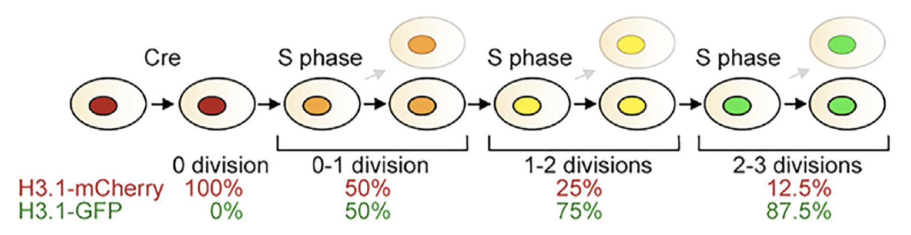

## Abstract

Cortical development is a highly regulated process that relies on the precise control of the cell cycle to generate the appropriate number and types of neurons.
Genetic or environmental perturbations in the cell cycle of neural progenitor cells can influence their proliferation and fate specification,
with such dysregulation postulated as the primary cause of cortical malformations, such as prenatal microcephaly.
To gain a deeper understanding of the molecular mechanisms underlying the relationship between the cell cycle and differentiation, we intend to combine single-cell transcriptomics (scRNA-seq) methods with well-validated cell tracing techniques to comprehensively characterize cellular states across various developmental time periods.
More specifically, our aims are as follows:
**(Aim 1)**: Develop feature barcoding methods to integrate readouts from complementary cell tracing techniques into scRNA-seq assays.
Unlike existing methods that artificially separate cell populations into bins, our approach will directly quantify the amount of tracer in each cell,
significantly increasing resolution and enabling the use of more refined statistical models.
**(Aim 2a)**: Characterize the transcriptional state resulting in specification of neuronal subtypes as a function of the number and rate of neural progenitor divisions.
**(Aim 2b)**: Investigate the effect of alterations in mitotic length on changes in differentiation using heterochronic mouse models.
These combined approaches will enhance our understanding on the spatiotemporal heterogeneity of neural progenitor fate determination.

## Specific Aims (1 page)

Neurogenesis requires the precise orchestration of proliferation and differentiation, both of which are intimately related to the cell cycle.
This relationship is evident in the brain, where the cell cycle tends to lengthen on average as brain development progresses [@pontiCellCycle2013].
Moreover, acute lengthening of the cell cycle has been shown to disrupt neurogenesis, resulting in a reduced number of progenitor cells and altered cell fate specification, which are associated with neurodevelopmental and psychiatric disorders [@mitchell-dickAcuteLengthening2020].
Although the single-cell diversity of the developing cortex is becoming increasingly well characterized [@johnsonSinglecellAnalysis2015],
our understanding of how temporally progressing transcriptional state, particularly the cell cycle, generate the neuronal diversity remains limited.
A comprehensive understanding of transcriptional signature that controls the proliferation and differentiation of neural progenitor cells can pave the way for valuable insights into cortical development and its associated disorders.

Cell tracking and labeling assays are based on the timed introduction of tracers, such as nucleoside analogs incorporation and fluorescent dye dilution.
To integrate this information with the cell's transcriptiomic state, a common approach involves sorting cell populations based on fluorescence intensity of tracers prior to single-cell sequencing [@luComprehensiveView2022].
However, this method of artificially categorizing continuous cell populations into 4-6 bins inevitably leads to information loss and introduces bias [@trippeRandomizedGates2022].

Instead, we will leverage feature barcoding techniques to simultaneously measure the quantity of tracers and the cell's transcriptional state during single-cell sequencing.
This approach eliminates tracer quantization and significantly improves the resolution of our analysis, which is essential for accurate statistical model fitting and data interpretation [@hyrienMixtureModel2008].

**Aim 1**: Develop a set of molecular tools to explore the mechanism of neural progenitor fate specification as a function of the cell cycle.
This includes the integration of existing tracing tools, such as EdU pulse labeling, with scRNA-Seq through feature barcoding.

**Aim 2a**: Investigate how specification of neuronal subtypes is affected by key parameters of the cell cycle, particularly the number and rate of neural progenitor divisions.
We will use the developed tools to assess the distribution of cell cycle rates during fate specification and how it relates to the cell's transcriptional signature over multiple time periods.

**Aim 2b**: Demonstrate the effect of cell cycle perturbation on fate specification using genetic and pharmacological approaches. We will assess changes in the expression of fate-determining transcription factors and evaluate the transcriptional signature of altered fate decisions.

## Research Strategy (6 pages, including figures and tables)

### Background and Significance (~1.5 pages)

<!-- Sketch briefly the background to the proposal. State concisely the importance of the research described in the proposal by relating the specific aims to broad, long-term objectives. Clearly relate the long-term objectives and theories to the specific hypotheses to be tested. Use this section to provide an account of any preliminary studies that might demonstrate the utility of the proposed project as a training experience. -->

Neurogenesis relies on the precise control of neural progenitor cell proliferation, cell cycle exit, and differentiation to produce the diverse array of neurons and glial cells at the appropriate time and location.
Progenitor cell populations transition through different modes of division over developmental time periods.
The progenitor pool is initially expanded through symmetric divisions followed by patterning through differential growth rate during asymmetric and symmetric neurogenic divisions.
Neurogenesis is strictly orchestrated spatially and temporally, with progenitor cells altering their competence and generating different cell types over time [@kohwiTemporalFate2013].

In stem cell research, cell fate specification is known to be intimately connected to the cell cycle [@pauklinCellcycleState2013; @langeCdksCyclins2010].
Similarly in the brain, the G1 phase is known to lengthen over the course of mammalian cerebral cortex development [@calegariSelectiveLengthening2005].
The mammalian cortex's signature six-layered structure itself is formed by consecutive waves of neurogenesis with laminar fate of each neuron determined during the final S or G2 phase of the progenitors [@frantzRestrictionLate1996]. It is, therefore, not surprising that any perturbations to the cell cycle would have deleterious impacts to neurogenesis.
In humans, heterochronic mutations have been associated with microcephaly [@doobinMicrocephalyCell2016].
Furthermore, microcephaly secondary to Zika virus infection has been associated with mitotic catastrophe in neural progenitor cells [@rychlowskaZikaVirus2022].

In addition to global alterations in cell cycle kinetics,
differences in cell cycle kinetics across neural progenitor population
are known to cause different fate specification [@fabra-beserDifferentialExpression2021].
Studying

Progenitors can output heterogeneous neuronal populations [@llorcaStochasticFramework2019]. APs can revert their temporal identity and re-enter past molecular states to once again generate normally earlier-born neurons. By contrast, late-born IPs are committed progenitors that lack such fate plasticity. These results highlight an unexpected cell-type-specific diversity in the temporal plasticity [@oberstTemporalPlasticity2019]. How and when stochastic neurogenic decisions are made remains to be elucidated. How do alterations in mitotic length drive rapid changes in differentiation? The time at which the cell exits the cell cycle is its “birth date.” In most systems studied, there is a correlation between birth date and fate, giving rise to the process known as histogenesis
Single-cell analyses of neocortical progenitors revealed molecular and cellular heterogeneity [@yuzwaDevelopmentalEmergence2017; @johnsonSinglecellAnalysis2015].
Comparing the division history of neurons in the deep and upper layer of the developing mouse cortex revealed that, indeed, radial glia cells generating deep layer neurons divided less as compared to those generating upper layer neurons, supporting the current model (Gao et al., 2014). However, we observed a substantial amount of deep- and upper-layer neurons that showed the same green/red ratio and thus arose from radial glia cells that underwent the same amount of cell divisions. These findings indicate that not all radial glia cells first produce deep and, later, upper layer neurons, but rather suggests the existence of different radial glia cells being active at different times during development.

Background technology.

### Research Design and Methods (~4.5 pages)

### Aim 1: Development of Cell Cycle Profiling Tools

To answer the questions described in the specific aims, we need a set of molecular tools can provide temporal and spatial context to the single-cell transcriptomes.
Here, we plan to develop a set of cell tracing tools that can be precisely quantified alongside the cell's transcriptome via scRNA-seq without cell sorting.
This also has the benefit of not quantizing our data, which is crucial for statistical model fitting [@hyrienMixtureModel2008].
Several labeling reagents are chosen based on their ability to complement each other.
By varying the pulse-chase interval, a mathematical model, CycleFlow [@jollyCycleFlowSimultaneously2022], can calculate parameters of the cell cycle, including its rate.

#### CFSE

During development, neuroepithelial cells proliferate in the ventricular zone (VZ) that are adjacent to the ventricular lumen.
A hallmark feature is interkinetic nuclear migration,
in which the nuclei are translocated according to the cell cycle phase,
with the M phase occurring in the apical (luminal) zone while S-phase occurs in the basal (pial) zone [@kosodoRegulationInterkinetic2011].
Cells that are in the M-phase can be labelled by an intraventricular injection of carboxyfluorescein succinimide ester (CFSE) a cell-permeable, amine-reactive variant of fluorescein.
The short half-life and reactiveness of the dye functionally restricts pulse-labeling to juxtaventricular cells [@telleySequentialTranscriptional2016].
After an initial wash phase where fast cycling proteins are degraded, the fluorescence signal intensity is diluted by two-fold after each cell division.
Using this strategy, isochronic cohorts of VZ cells can be identified and tracked through their proliferation and differentiation. However, this fast kinetics also restricts labeling only juxtaventricular cells. Hence, this approach is the most useful for visualizing the migration profile of different prognitor cohorts.

#### EdU

Ethynyl uridine (EdU) is a nucleoside analog that is incorporated into the cell's DNA during the S phase and is widely used for proliferation tracking.
EdU is persistent through the cell's live and gets diluted into its progeny.
The key advantage of EdU compared to CFSE labeling is that EdU can be introduced system-wide through an interperitoneal injection with the trade-off of lower time resolution than that of CFSE.
To detect EdU,we can react the ethynyl group with an azide group in a simple CuAAC bioorthogonal reaction.
Unlike earlier nucleoside analogs, like BrdU, this requires no heat treatment for epitope unmasking.
EdU's downside includes its toxicity as it can trigger mitotic arrest though the activation of DNA repair pathways [@ligasovaFatalCombination2015].
Therefore, we plan to use _f-ara_-EdU, a significantly less toxic variant of EdU for our studies [@neefDynamicMetabolic2011].

#### iCOUNT

The inducible cell division counter (iCOUNT) method relies on recombination-induced tag exchange (RITE) of endogenously tagged long-lived proteins to fluorescent proteins to track the number of cell divisions [@denoth-lippunerVisualizationIndividual2021].
In this case, histone variant H3.1 is tagged with mCherry and would switch to EGFP upon Cre activation.
Then, every subsequent cell division would reduce the amount H3.1-mCherry by half
as new H3.1-EGFP is produced to refill the pool of histones.
By comparing the ratio of intensity between mCherry and EGFP, we can infer the number of cell cycles since Cre activation.
This approach provides several benefits compared to previous methods, including integrated signal normalization and system-wide labeling.
The authors claimed that this method can count up to 3-4 cell divisions _in vivo_. iCOUNT mice are now commercially available and our collaborator, Dr. Dwight Bergles, already has them expanding in his colonies.

<figure>

<figcaption>

Figure 1b from [@denoth-lippunerVisualizationIndividual2021]

</figcaption>

</figure>

#### Combining Labeling with Transcriptomics

The studies of neural progenitors have been dependent on these labeling strategies.
Yet, their utility could be much greater if we could precisely combine the labeling readouts with transcriptome-wide measurements.
Current studies utilizing these labeling strategies are generally limited to imaging in conjunction with immunofluorescence labeling [@telleySequentialTranscriptional2016], cell sorting [@luComprehensiveView2022], and a limited set of genes using FISH [@westSpatiotemporalPatterns2022].
In order to combine these labeling strategies with scRNA-Seq methods, we need to label these tags with oligonucleotides [@blackCODEXMultiplexed2021; @stoeckiusSimultaneousEpitope2017].
For CFSE and iCOUNT, I will use oligonucleotide-conjugated antibodies to FITC [@goodProliferationTracing2019], EGFP, and mCherry, respectively.
Linking EdU to an oligonucleotide has proven more technically challenging as we do not want to use antibodies as these neccessitate harsh epitope unmasking.
Instead, I designed an assay in which biotin azide is reacted with EdU and subsequently detected with oligonucleotide-conjugated streptavidin. CFSE can be labeled with anti-FITC antibodies with good efficacy.

I plan to use sci-RNA-seq3 [@martinOptimizedProtocol2022], a cost-efficient method that would allow us to scale our analysis to larger cell numbers and conditions.
Afterwards, I will use the software I wrote along with published softwares, such as kallisto, to run the processing pipeline.
Differential gene expression analysis can be done using the likelihood ratio test comparing the expression value between cells in different conditions.
Heterogeneity can be initially assessed using embeding methods, such as tSNE and UMAP.

#### Validation

We will perform validation of these labeling techniques using _in vitro_ cell culture experiment with the HEK293T and Jurkat cell lines.
To establish the ground truth of cell cycle parameters, we will employ the Fluorescent Ubiquitination-based Cell Cycle Indicator (FUCCI) [@bajarFluorescentIndicators2016] to track the cell cycle in a live cell imaging experiment.
This FUCCI system has been established in the lab and clonal population of cell lines have been generated.
To determine the senstivity of the detection of the change in rate, we will pulse cells with EdU/CFSE alongside with pharmacological agents that perturb the cell cycle, such as hydroxyurea and nocodazole.
We will collect the cells for sequencing after several chase intervals.
This would be done in concordance with the tricycle algorithm, which phases the position a cell is in its cell cycle from its transcriptional state [@zhengUniversalPrediction2022].
Tricycle provides substantially higher resolution compared to the standard method of artificially binning the cell cycle into four phases and analyzing them separately.

### Aim 2a: Investigate how specification of neuronal subtypes is affected by key parameters of the cell cycle

Prior studies have established Sox9 as a mediator for cell cycle length in a subgroup of radial progenitor cells with reduced neurogenic behavior [@fabra-beserDifferentialExpression2021].
This is in agreement with other studies using pharmacological approaches to slow the cell cycle [@mitchell-dickAcuteLengthening2020].
Here, we plan to extend the results of these studies by performing a transcriptome-wide characterization of radial progenitor cell population and their temporal behaviors using the tools described in Aim 1.
Using mice from various timepoints during development between E10.5 and E15.5,
I will infer a set of other differentially expressed genes that correlate to the position of the cell in a cell cycle, along with other parameters of the cell cycle.

Furthermore, by using the high-resolution tracing capabilities of our tools, we could study in parallel the behaviors of heterogeneous populations and identify key differences in their transcriptomic signature.
As a validation, we plan to test whether we rediscover _Sox9_ in our dataset as differentially expressed.

### Aim 2b: Demonstrate the effect of cell cycle perturbation on fate specification using genetic and pharmacological approaches

The role of the cell cycle dynamics in neurogenesis is made apparant through genetic or pharmacological perturbation.
In humans, heterochronic mutations have been associated with microcephaly [@doobinMicrocephalyCell2016].
Furthermore, microcephaly secondary to Zika virus infection has been associated with mitotic catastrophe in neural progenitor cells [@rychlowskaZikaVirus2022]. In experimental settings, mutations in genes, such as _Magoh_, [@sheehanDosagedependentRequirements2020] have been shown to result in mitotic defects.
I plan to use a mouse line our lab experience with, the _Pantr2_ KO mice [@augustinPantr2Transacting2022].
_Pantr2_ is a long non-coding RNA that alters cell cycle dynamics and I plan to probe in detail the mechanisms of such alterations through tools developed in Aim 1.

### Data analysis

I will reconstruction of cellular histories by integrating transcriptiomic data with tracer data.
The cell cycle kinetics can be inferred using the CycleFlow algorithm [@jollyCycleFlowSimultaneously2022].
By using the tracer as a covariate, I will initially perform regression analysis to discover differentially regulated genes in cells with different cell cycle kinetics.
alongside with This approach will enable us to both implicate known pathways in specific cellular contexts and discover new functional groupings of co-regulated genes that affect the fate specification of distinct neuronal subtypes in relation to the impact of prolonged mitosis on microcephaly and associated developmental disorders.

Additionally, I will use my lab's experience with latent space representations to develop analytic approaches that is more representative of the complex biology compared to marker gene-based techniques.
These analyses allow me to discover new functional groupings of co-regulated genes that affect the fate specification of distinct neuronal subtypes in relation to the impact of prolonged mitosis on microcephaly and associated developmental disorders.

#### Anticipated problems that might arise and alternative plans to accomplish the specific aims if these problems arise

I have preliminary data demonstrating _in vitro_ success of these methods through the detection of oligonucleotide-tagged EdU using sci-RNA-Seq3 along with flow cytometric detection of oligonucleotide-conjugated antibodies to CFSE.
The major risk that remains is the adaptation of the method to _in vivo_ conditions.
However, both EdU and CFSE are in widespread use, and we do not anticipate major difficulties.
If they do not work, we can fallback to using fluorescent reporters alongside FISH techniques.

### Tentative sequence for the investigation

#### Year 1 (Present - December 2023)

I plan to complete the primary development and _in vitro_ characterization of assays described under Aim 1.

#### Year 2 (January - December 2024)

After gaining broad understanding of the assays and their properties, I will begin Aim 2A and 2B of my research plan.
I will study and infer cell cycle parameters in the embryonic mouse brain as described in Aim 2A.
Afterwards, I will then move to Aim 2B and extend my study to _Pantr2_ mice, a heterochronic mouse line, to investigate the mechanisms in which the cell cycle is altered.

#### Year 3 (January 2025 - ~June 2025) Anticipated year of graduation

I will rigorously analyze the data collected from all of my aims to begin to draw conclusions and develop a predictive mathematical model as a function of the cell cycle.
I believe I will discover differentially regulated genes in different progenitor population as a function of their cell cycle kinetics.

## References

<!--
- Failure to

I have developed Samui Browser for the visualization of high-dimensional biological data. We also confirmed the chemistry of EdU-tagging with flow cytometry. A preliminary panel with MERFISH genes are ready -->

<!--
Cell autonomous from transplant experiment. Data from migrating cells. Organization of

Get parameters for cell cycle model.
Single-molecule fluorescence in situ hybridization (smFISH) is [@rajImagingIndividual2008]

However, this technique does not provide information about the spatial context of the cells, as the cells are dissociated and analyzed independently. Due to IKN, gaining spatial context is useful. Transcriptomic state.

Spatial transcriptomics, on the other hand, allows for the identification and quantification of gene expression in situ within a tissue, providing information about the spatial distribution of gene expression. This technique enables the visualization of gene expression patterns within the context of the tissue, revealing insights into the spatial organization of cell types and cell-to-cell interactions.

By combining these two techniques, researchers can gain a more comprehensive understanding of gene expression in complex tissues. scRNA-seq can be used to identify cell types and gene expression signatures, while spatial transcriptomics can provide information about the spatial distribution of these signatures within the tissue. This approach can help identify cell-to-cell communication and signaling pathways that are important for normal tissue development and function, as well as for understanding how these processes may be disrupted in disease.

scRNA-seq provides an unbiased view of the transcriptome, albeit with high dropout rates. FISH-based techniques must be specified using probes but have >90% detection efficiency. -->
